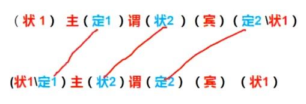

# 逻辑英语

## 公式的运行和词汇语法重建

### 1.公式的推导和基础运行

- 中英单词对称
- 语言**排序**不同
- f(x)=y

- **主语**：是执行句子的**行为或动作的主体**

- **谓语**：是对主语**动作或状态的陈述或说明**，指出“做什么” do what, “是什么” what is this或是“怎么样”how

- **宾语**：又称受词，是指一个**动作（动词）的接受**

- 英语陈述语句公式：[状1]       主 [定1] 谓 [状2] [宾]  [定2\状1]
- 中文陈述语句公式：[状1\定1]   主 [状2] 谓 [定2] [宾]  [状1]
- 插入语(与原句没有关系，是独立存在的): `', ", ~`
  - 这个女孩，在我看来，很漂亮。

I Love a girl

She died (没有宾语)

(You) come here。主语省略了，省略不代表没有。

我爱你

去年（状1）我爱你

去年（状1）一个非常胖的（定1）胖丫头（主），非常热情的（状2）爱上了（谓）瘦瘦的(定2)你（宾）

----

**英语**：状语 主谓语 状语

**汉语**：状语 主谓语 状语

句首和句尾的状语在中英位置相同

I get up in the morning. 早上起床（没有强调）

In the morning, I get up. 强调在早上起床

----

- **中文**：修辞在前，重点在后（东方）**归纳法**
- **英文**：修辞在后，重点在前（西方）**演绎法**

----

#### 为什么？文化差异？

- 东方：农业文明（过程优先）
  - 天时：使民以时
- 西方：商业文明（效率优先）

----

She is pretty in my eyes. 在我眼里，她很漂亮

In your life(状1), **a friend** that is helpful **is** **a friend** that you should thank(状1).

主干体系：在你的一生当中，一个总能帮助你的朋友是一个应当感谢的朋友

在北京，没有钱的年轻人以这种方式也能实现他们心中的梦想。

在北京，年轻人没有钱的能实现以这种方式也他们心中的。

In Beijing, the young without money can realize in this way the dreams in their hearts.

#### 表语和插入语在哪里？

**I** can **see** in his eyes the **love** to me

**I** can **see** in this picture profound **rules** in life

去年(状1)我(主)买了一块表

我(主)去年(状1)买了一块表

### 2.主干的定位

> 主干，一个哲学问题

- 主语：主体(名词，静态)
- 谓语：动作/行为（静态变成动态）
- (宾语)：行为接受对象(名词，静态)

#### 2-1 主语

> 句首的**独立名词**性结构(名词,代词,分词,从句 it)

- 名词
  - In his eyes, **Jack** is aliar.
  - In his eyes 的 eyes 在`介词短语` in his eyes 里面，所以不是eyes名词不是主语

- 分词(分身love, loving, loved)
  - **Living** in a city is always convenient.

- 句子
  - **That no one can live without water** is true.

- 从句作为主语（that 开头）
  - **It** is true that no one can live without water.
    - it 是形式主语
    - it 指向 that no one can live without water. 逻辑主语

#### 2-2 谓语

> 排除过程

- 从句中和介词短语中动词
  - The man who is smiling **is** jack. 正在笑得那个人是jack

- 主语前动词
  - **In fighting**, the brave wins. 在战斗中，勇者获胜

- 分词前无助词(have be)
  - I **am** working
  - I have **married**. I am **married**.
  - 分词：ing, ed => working, married

- 谓语可以是动词词组
  - I **want to see** you
  - I **want her to see** you

  - **The methods** that a community devises to perpetuate itself **come into being to** **preserve** of the cultural legacy that that community perceives as essential.
  - `GRE` 考试

#### 2-3 宾语-谓语后的独立名词结构

- 宾语可以没有
- 句=主+谓
- He left.
- He is smart.

- Althought not so reasouable, **a man** that is so weak in daily business **is** always **a loser** that can't fulfid his dreams in his life.

- 主干：a man is a loser

## 中文主干的寻找：

1. （你）不作死不会死。英文祈使句常省略主语 come here
2. 她很好 She is very good. 中文省略了谓语
3. （如果）山无棱天地合，（我）始敢于君绝。 英文必须有关联词
4. 我的英语是（被）体育老师传授的。省略了**被动**

### 3. 内部排序的运行算法-倒置逻辑

- I know the man who is singing. 我认识正在唱歌的那个人
- I know the man who is singing in the car. 我认识那个在车上正在唱歌的那个人
- I konw the man who is singing in the car that i bought last week. 我认识那个上周我买的车里唱歌的那个人
  - the man => who is singing(doing) / in the car(where)
  - in the car => i bought(doing) / last week(when)

- 排序是按**短语排序**

### 短语的三种形式：**从句**

- 介词短语： in the car => (who is) in the car
- 从句： who is sing => singing
- 分词结构：singing

- 四级翻译：众说周知，杭州是在中国历史上被很多诗人赞美的城市。
- As we all know, Hangzhou is a city that has been praised by many poets in the history of China.

- For an action movie as big/ as The Expendable 3/ with an all start cast/ so familiar to Chinese audience, a large promontional touar/ won't bring/ any extra benifits that they expect.

- 对于中国观众非常熟悉的由全明星阵容所扮演的敢死队3，这么大的动作电影来说，一个大规模的促销旅行并不会带来他们所期待的任何额外好处。

###　语法重建第一集：名词的世界

#### 1. 数量问题：可数和不可数

> 可数可以省略量词

- 固定单位：a cup of water
- Fish: 即可数不可数，为什么？
  - 鱼：可数
  - 鱼肉：不可数
- sheep：一词不固定
- time：单位不固定
- Coffee/tea: `a cup of coffee` 演变为 `a coffee`
- Paper
  - 纸张：不可数
  - 卷子：固定单位
  - 论文：固定单位
- Experience:
  - 经历：可数
  - 经验：不可数
    - 一条经验
    - 一些经验
- Glass：
  - 玻璃：不可数（一片，一块，一堆）
  - 眼睛：可数

- 即可数又不可数：hair, corn, grass, popcorn, rice, salt, sand, snow, sugar

#### 2. 就近和就远原则（扯淡）

- 就远
  - A woman with two children (is) comming.
    - 主语：a womain
    - 定语：with two children
  - I was well as they (am) ready to help you

- 就近
  - Not only I but also he (is) right.
    - 不仅仅是我
    - 主语：he
  - Both I and he (are) right.
  - Neither you nor I (am) fit for the work. 既不是你也不是他
  - (Are) neither you nor I fit for the work?
  - There (is) a pencil and two pens in the pencil box.

- 主语中心原则
  - There be 唯一没有主语

#### 3. 集合名词的数量逻辑

- family Class cattle group

- 我家很有钱 My family is rich
- 我家都疯了 My family are mad

### 复习

- 在充满激烈的竞争的媒体行业，一个对中国文化的基本特征没有清晰理解的**记者****不能写出**有关目前中国改革开放的变化的意义的**好文章**。In the media industry full of fierce compretition, a reporter without clear undertanding of the basic features about Chinese culture can not wirte good articles of the significance about the reform and change in china today.

- Although not so world widely accepted, people who are emotionally weak in daily business are often losers who are not able to fullfill any fruitful achievements in their lifetime that they endure.

- **The method** of scientific investigation **is** basically nothing but **the expression** of the necessary mode of working of the human mind in practice.

- **Studies** of both animalas and humans in his recent research **have shown** the **impact** of sex hormones on stress response under the same conditions.

- 祝寿

they came to BJ to say happybirthday to qianlong.

- 在帮组国际社会于2030年前消除极端贫困过程中，中国正扮演者越来越重要的角色。自20世纪70年代末实施改革开放以来，中国已使多达四亿人摆脱了贫困。
In the process of ending extreme poverty before 2030 for then world, China is playing a role that is more and more important. Since apllying the open and reform policy from late 1970s, China has helped as many as 400 million people get rid of poverty.

## 排序逻辑 2

- 排序规则 2：并列不变序
  - 并列 and
  - 转折 but
  - 选择 or
  - 递进 from to

- if 123
- 2 and 3
- So 231

- 在工作中没有激情**也**没有想法的人不会有进步。A man without passion and (without) ideas at work will not make any progress.

- if 12345
- (23) and (45)
- x and y
- xy1
- 32 54 1

- 1 (234) and (567)
- 432 and 765 1

- (123) and (456) 7
- 6 321 654

- 在一生当中，(当你有困难的时候帮助你)和(当你成功的时候离开你的)(人)才是真的朋友。In your life, a man who help you when you are in trouble and who leaves you when you are successfull is a real friend.

- Science, in practice, depends less on the experiment it prepares than on the preparedness of the minds of the men who watch the experiments.

- in practice, 插入语
- less ... than ... 与其 ... 不如....

- , and element (in national economic life) (representing the irresponsible wealth) (detached) (from the land and the duties) of (the land owners) and (almost equally detached) (from the responsible corporate management) of (commericial business conduct). 土地拥有者和土地责任制之间相分离，同时和商业行为和负责任的管理之间也几乎同样相分离代表了不负责任的财富的国家经济生活当中一个元素

- 贤者，处江湖之远而忧其君；居庙堂之高而忧其民。
- 古文 -> 现代语 -> 翻译
- 一个在社会底层生活还是为皇帝担忧；在朝廷中央做官还有民众担忧的人是一个好人。A man who worries for the king when he lives in lower class and worries for the people when he works in the central government is a man of virtue.

- 并列短语
- Thus, in the American economic system it is the demand of individual consumers, **coupled (with the desire of businessmen to maximize profits )and (the desire of individuals to maximize their incomes)**, that together determize what shall be produced and how resources are used to produce it.

- **As man own studies have advanced,状语**, **I，主语** **have been increasingly impressed，谓语** **with the functional similarities between insect and vertebrate societies** and **less so with** the structural differences that seem, at first glance, to constitute such an immense gulf between them.

- I'm happy and you are so too.
- I'm happy and so are you.

## about time

- 我昨晚已经看过这个电影了
- I watched this movie last night. 一般过去式
- I have watched this movie last night. 现在完成时

## 公式的复习

- not only ... but also 不仅，如此

- 转折:与其，不如
  - not so much ... as
  - less ... then

## 插入语

- , " --- 逗号，分好，破折号
- , 并列语句也有可能

## 插入语放置位置

- 原处：很多插入语
- 首/尾: 很长插入语

- The emphasis(强调) on data gathered first-hand, combined with a cross-cultural perspective brought to the analysis of cultures past and present, makes this study a unique one.

插入语->状语->短语结构，不会名词开头

- 过去和现在文化的分析所带去的一种跨文化的的视野结合起来之后。对于第一手收集的数据的强调，使这个研究成为一个独特的科学。

- The United States is the product of two principal forces---the immigration of European peoples with heir varied ideas, customes, and national characteristics and the impact of a new country which modified these traits. 美国是两种主要力量的产物——欧洲人的移民有不同的想法，习惯，国家特征以及一个新国家的影响他们改变了这些特征

- 并列: ...., ..., ..., and ...

- Social science is that branch of intellectual enquiry which seeks to study humans and their endeavors / in the same reasoned, orderly, systematic, and dispassioned manner that natural scientists use for the study of natural phenomena.社会科学是试图去研究人类和他们追求的一种智力探索的分支，它同自然现象的研究中自然科学家用到了相同有逻辑、有条理、有体系和有理性的方法。

短语间分
, 这 + 前词

## about time 时态

- 为啥英文有时态 中文没有？

- I watched this moive last night.我昨晚已经看过这个电影了
- I have watched this movie last night.我昨晚前已经看过这个电影了

### 点时态

> 时间点，精确到时间点

- 一般现在：表示常态，规律，习惯
  - The sun rises in the east.
  - We are going to leave tomorrow, the train leaves at 6:00.

- 一般过去：过去的就过去了
  - I saw him last night.
  - I was a boy.
  - I tried to help her.

- 一般将来：打算，计划，说说未来，说说而已
  - I will be back!
  - She is going to kill you!
  - 区别？
  - You will die. 客观性
  - You are going to die. 主观性

### 进行 更加精确的点

- 现在/过去/将来 的进行 表达不同时候的精确动作
  - I am working now.
  - He was crying when i came in.

- 现在的进行 也能表达将来和惯例
  - I am coming!
  - You are always talking!

- 将来的进行
  - I will be enjoying my dinner at 7:00 PM tomorrow.

- from ... to ... 从哪到哪
- since ... 自从
- so far, until now 到现在为止

### 段时态

> 完成。现在开始到之前时间段

- 现在：到现在为止 have/has + 过去分词
  - I have married now. 现在为止
- 过去：过去之前 /had/ + 过去分词
  - I had married before I met you. 过去为止
- 将来完成：未来某个时间之前 will have + 过去分词
  - I will have married before 2050. 将来为止
  - I had been happy in the whole 2015.
- 其他时态：杂交
  - I was going to marry you. （曾经打算）过去将来时
  - I have been waiting for you. 现在完成进行时
  - I have waited for you.

- 今年在长沙举行了一年一度的外国人汉语演讲比赛。这项比赛证明是促进中国和世界其他地区文化交流的好方法。它为世界各地的年轻人提供了更好地了解中国的机会。

- This year, we held in Changsha a speech contest of chinese for foreigners once a year.

- 《维特根斯坦》导师 - 罗素

## 虚拟

- 过去时=>过去完成时
- 现在时=>过去时
- 将来时=>过去时

- 基本模式：时态后移
  - 如果我是你，我就弄死他 If I were you, I would kill him.
    - 时态一定要变错，be动词变错，最终说明我不是你

如果我是个女的，我就嫁给他

- 现在
  - If I were a woman, I would marry him. 虚拟-故意弄错，提醒对方
  - If I am a woman, I will marry him. 不是虚拟(去泰国/韩国)

- 过去
  - If I had come last night, I wouldn't have missed you performance.
  - 对比：If i came last night, I wouldn't miss your performance.

- 将来
  - If I should die tomorrow, I would die with honor.

- 杂交
  - 过去/将来
    - 如果我早点认识你(过去)，我明天就和他离婚(将来)。
    - If I had met you earlier, I would divorce him to tomorrow.

## 重建单词精神家园

### C

- contain 包含
- cover 锅盖/覆盖/采访(covered a news)
- close 关闭
- copy 复制/复印
- circle 圆圈
- copyright 版权
- can vt.能 n.罐头
- china n. 瓷器
- country n. 国家
- company 团队/公司
- cooperation n. 合作/协作/配合
- circ adv.大约
- cyc n. 轮子;圆圈;循环
- coat n.外套
- clos adv.秘密地
- clud 关闭
- city 城市/围城
- cap n.帽子 vt.盖住
- civilization n.文明/文化
- civil law 民法
- clock 钟表
- clock wise  顺时针方向的
- anticlockwise 逆时针方向
- cabbage 包菜
- ceive\cept 拿\词根抓; 取
- cabin 机舱
- cabinet 内阁
- canvas 帆布
- campus 校园
- camp 露营
- cell 细胞
- case 箱子
- cave 山洞
- ceiling 天花板
- chair 椅子 stool/凳子
- chairman 主席
- center 中心
- core 核心
- cuddle 拥抱
- calefaction 温暖（的状态）

- 第一次来到中国的外国人经常为在这个国家为经济发展而付出的环境代价而震惊。
- **Foreigners** who came to China for the first time **are often shocked** by the environmental price paid for the economic growth in this Country.

- 虚拟复习
- 如果我不爱你，我就不会告诉你这个了。If I hadn't loved you, I would't have told you about it.

- 是码？如果你爱我，你早就告诉我了。Really? If you had loved me, you would have told me earlier.

## 虚拟的延伸

### 隐含的虚拟

- What will you do with a million dollars? 虚拟假设，穷
- what will you do with a millon dollars? 已经有钱，富
- Without water, we would all die now. 虚拟
- If there were no water, we would al die now.

### 自带虚拟色彩的词组

- If only I were a girl! 如果我是一个女. 如果...就好了
  - only if 只有我
- If only I were in Australia.

- It is time that we went home!. 现在该是...的时候了

- 虚拟跟真实正好相反

- I wish I were rich. 我希望我有钱。 祝福于反现实

- I would rather she were a man. 我宁愿她是男的。

## 升级版的 C

包: core/center/capital

### 第一组 clos/clud

> 关闭/关门

- close, disclose(dis相反, 揭示)，like <=> dislike
  - A secret has been disclosed. 一个秘密已经揭开了。
- enclose(关进去，包含进)
  - A letter is enclosed in this bag.
- include(包含)
  - He is a very inclusive person. 他是一个非常有包容性的人
- exclude (v. 排除)
  - e = ex 出去
  - exclusive(为什么高档的)，专项的

- preclude (pre 提前时间) 预防
  - prepare 提前准备
  - previous 预备

- conclude v. 结论
  - n. conclusion
  - con/com/co 一起
  - reach a conclusion. 得出结论;达成一个结论

- seclusion 隐居
  - se + clu + sion
    - secret

## 第二组 circ/cyc 圈

- circle
- bicycle
  - bi + cycle (bi:双) 双轮车
  - auto mobile: 汽车
  - bisect (一份为半)
  - unit
  - university
    - college n. 大学；学院；学会
  - universe n. 宇宙；世界；领域
  - unique 独特的
- recycle
  - re + cycle (回收)
    - re: 重复
  - return (返回)
- circus 马戏团
- circuit 电路 ['sɜːkɪt]
  - cctv: close circuit tv
- circumstances 环境
- circulate  循环
  - cir + culate(ate动词)
- circulation
- encircle
  - en + circle (包围)

## 第三组 cap 大覆帽

- captain 警官/船长
- capture 抓
- catch 抓住
- captive 囚犯
- capital 首领

## 第四组 -ceive/-cept 接受(抱抱=>C)

- receive 接收
- acceept 接受
- conceive 理解/认知 = know = 内心接收 = 古代英语(身体/精神,接收)
  - Do you know?
  - the man knew his wife, and she conceived Gain.
  - May I know you further?
- conceivable
- deceive 骗
- deceptive 欺骗的
- concept  你知道的，我知道的，大家都知道的 =>  n. 知道的(概念)
- perceive (per 完) 完全知道

- Today I went to a circus. I saw a man riding a bicycle in the core of the camp, holing a can in his hand. The actor was encircled by many people, including children and the old-age. The play was easy to conceive, but it also produced many wastes that need to be recycled. A captain was sitting in a chair there to keep order, encircled by 3 dogs.

## 公式的升级

### 复杂模型和定语从句

### 简单 vs 复杂

- 简单到复杂 《周易》
- 复杂=>并列

- 并列/选择/递进

### 理想照进现实-蛋理论

- I love you **and** I hate you.
- **Although** I love you, you hate me. 尽管
- I love you **because** I hate you. 因为
- 本质：句加句

- The creation of books is a big progress for human beings, but the invention of computer is even more valuable. 书的创造是人类的一大进步,但是计算机的发明更加有价值

- Because he is so inexperienced in dealing with business matters, his father decides to remove him from the post of CEO in the company. 因为他在商务处理上没有经验,他的父亲决定公司里解除他的 CEO 的职位.

- The method of scientific(科学) investigation(调查) is nothing but the expression of the necessary mode of working of the human mind **and** it is simply the mode by which all phenomena(现象) are reasoned(推理) about and given precise and exact explanation. 科学调查的方法只不过是人类思维工作必要模式的表达, 并且它仅仅是通过它所有现象的推理并且给予精准解释的模型
  - nothing but 只不过是
  - it 指向的是

## 中文双黄蛋的困境:省略

- (我们)垃圾分类,从我做起(这件事)
- 中文意会

- 英文: 滴水不漏

- 朋友们按照传统在过年的时候会互致问候,(并且)一些人还会送给对方新年礼物. Friends will exchange greetings on new year day according to our traditions, and some may also give presents to each other.

- 单黄蛋：主干并列
- 非句 + and + 非句

1. I love and hate you.
2. I love you and her.
3. You and I are friends.
4. You and I are love and hat him and them. 主语并列，谓语并列，宾语并列 => 杂交

- You **were, are and will alwyas be** in my heart. 谓语并列

- **The ideas** from the writer of such a book and **the stories** told by the roles in it attract(吸引)**many people** who are fond of reading. 这本书的作者观点以及在这本书中的主角们所讲的故事吸引了许多喜欢读书的人们.

- A man with a dog and a dog with a man are here.

- The target of research is motivated by converns broadly with the application of statistics and data analysis in scientific research and is part of Science's overall drive to increase reproducibility in the research we publish. 研究的目标受到科研当中统计和数据分析的应用广泛关注而鼓舞的,并且它是我们所出版的研究增加其可复制性而做出的科学总体动力的一个部分

- 考验翻译: Under modern conditions, this requires all kinds of measures of centralized control and the help of specialized scientists such as economists and research experts. 在现代的条件之下,这要求集中控制的各种不同的方法以及像经济学家和研究专家这样的专业科学家的帮助.

- But **the force** of geographic conditions peculiar to America, **the interplay** of the varied national groups upon one another. and **the sheer** difficulty of maintaining old-world ways in a raw, new continent caused significant changes.

## 第三部分 单词重建之

- 手机英文版
- 电脑英文版

## j

> 扔，甩

- jet 喷气式飞机
- ject 扔
- inject 注入(扔进去)
- injection  注射
- eject 弹出(光驱)，射出
- project v.投射(pro+ject，向前扔) n. 项目(未来的计划)
  - 重音在前名词，重音在后动词
  - projector 投影仪
- reject v.拒绝（往回扔）, 强硬， decline v.客气拒绝
  - refuse
- interject(inter中间/际) 介入、插入、干涉
  - internet 网络
- object (ob 相对，相对) v. 反对; n.物体(与主观世界相对的，与内心世界相对，所以是物理)
  - objection n.反对(法庭)
  - objective 客观的
- sub 方位(具体)：下面； 私下（抽象）：内心
  - subway 地铁
  - subjective 主观的
  - subject 科目/主题 => 主观的
  - su 缩写

- abject 可怜的、抛弃的
  - an abject boy in corner
- ab 远离
- abandon 远离
- abnormal 远离正常的
- adverb (adv.副词) ad靠近v(verb)动词

- ab 远离 <-> ad 靠近

- 臣本布衣，躬耕于南阳，苟全性命于乱世，不求闻达与诸侯。
  - **我**原本**是**一个普通人，在南阳**种地**，在这混乱的时代**过着**安稳的生活，也没有**想过**在诸侯那里有名气。I was a nobody(小人物), farmed in Nanyang, lived a peacefull life in such chaos, and never thought of any fame among those warlords. 单黄蛋->谓语并列
  - nobody 无名小辈
  - chaos 混乱时代
  - fame 名气
  - among  之间
  - warlords 诸侯

- judge 法官/ v.判断
- justice 正义，unjust
- just 公平的，unjust 不公平的
- jury system 陪审团
- case law 遵循先例

- The change met the techincal requirements of  the new age and precluded the decline in efficiency that so commonly destroyed the fortunes of family firms in the second and third generation after the energetic founders.

### 单词复习

- I can never conceive why she rejected me. She is such an inclusive girl, but objectively speaking, sometimes she lacks the confidence to face the reality. Now such a conclusion makes me think of a new project to bring her back. She is judging me in a wrong way.

## 第二部分 公式的推进

- 隐藏的双黄蛋：宾语从句
- I like it.
- I think that she is right. 宾语从句
- My idea is that you are right. 表语从句，宾语从句

- That she is objective is obvious. 主语从句
- Why you love me is strenge. 主语从句
- It is obvious that she is objective. 主语从句

- It may be said that **the goal** of reading of any historical book **is** **its effect** in enlarging and improving experience; **but** such a value is based on the quality of books you choose. 据说，对于任何历史书的阅读的目标是扩展和改进经验的作用。但是这个价值基于你所选择书籍的质量。
  - goal: 目标
  - effect: 作用
  - enlarging: 扩大
  - improving: 改进
  - quality: 质量
  - It may be said that 据说

- **A long view** of the history of English colonies (殖民地) that became the United States **has been** **that** England's policy(政策) toward these colonies before 1763 was dictated制定 by commercial interests 商业利益 **and that** a change to a more imperial 压制性 policy, dominated 主导 by militarist objecties 军事目标, generated 产生 the tensions 紧张 that ultimately led to the American Revolutions. - 美国高中历史读本。一个对成为美国的英国殖民地的历史的长期观点认为在1763年之前针对这些殖民地的英国的政策依据商业利益所制定，并且还认为一个朝向压制性政策的改变，军事目标的主导下，产生了最终导致美国革命的紧张局面。
  - 并与从句

## JU

> 判断，裁决（法律）

- whore 失足少女

- judge 法官 v.判断
- justive 正义 n. 大法官
- just 公平
- unjust 不公平
- jury system 陪审团
- caselaw

## 第三部分 定语从句之合并同类项

什么是定语： 确定范围

定语位置：主语后面，宾语后面

I like girls who have long hair.

### 有几种定语从句？只有两种

- 人：who
- 物：which

### 定语从句形成过程

我认识那个在车里哭的人。

1. 主干句:我认识那个人。I know the man
2. 从句：人在车里哭。 The man is crying in the car.
3. 合成一句：我认识那个人那个人在车里哭。I know the man the man is crying in the car.
4. 合并同类项：我认识那个在车里哭的人。I know the man who is crying in the car.

我不喜欢没有图片的书。

1. 主干句：我不喜欢书。I don't like books.
2. 从句：书没有图片。Books don't have pictures.
3. 合成一句：我不喜欢书书没有图片。I don't like books books don't have pictures.
4. 合并同类型：我不喜欢没有图片的书。I don't like books which don't have pictures.

### Where when

我特别讨厌我遇见他的那个城市。

1. 主干句：我特别讨厌那个城市。I really hate the city.
2. 从句：在那个城市我遇见他。I met him in the city.
3. 合成一句：我特别讨厌那个城市。I really hate the city I met him in the city.
4. 合并同类型：我特别讨厌我遇见他的那个城市。I really hate the city I met him in which. I really hate the city in which I met him. I really hate the city where I met him.

in which = where

介词不提前：This is the book which I am looking for(寻找：look for).

on which

of which

我都忘记你过来的日子了。

1. 我忘记日子
2. 你在那个日子过来

- I have forgot the day you came on the day.
- I have forgot the day on which you came.
- I have forgot the day when you came.

时间不等于 when

今天将会是一个你一辈子都记住的日子。

今天将会是一个日子 Today will be a day.

你一辈子日子都记住的 You will remember the day in your life

Today will be a day which you will remember in you life.

我有一条眼睛是蓝色的小狗。

I have a dog

a dog's eyes are blue.

I have a dog a dog's eyes are blue.

I have a dog whose eyes are blue.

### who's, which's => whose

why

我不理解他离开我的原因。

我不理解原因。它因为这原因离开我。

I don't understand the reason he left me for the reason.

I don't understand the reason for which he left me

I don't understand the reason why he left me

for which = why

### whom

我认识那个你喜欢的男孩

I know the boy. You like the boy.

I know the boy you like the body.

I konw the boy who you like. 不严谨

I konw the boy whom you like. 严谨

I konw the body you like. 简略（you like 主+谓）,宾语可以省略

#### whom 宾语

She is the girl to whom I owe an apology. 她是一个女孩对她我欠一个道歉。

I love my father, who is good to me. 插入语，**唯一性**，补充说明。我爱我爹，他对我很好

- He did not return last night, which makes me sad. 非限定，which **前面整句** 他昨天没有回来，这件事情让我疯掉。
- He did not return last night. It makes me sad.
- He did not return last night; It makes me sad.

- 连接词：
  - (),() and()
  - , which

### That 偷懒行为

- who, whom => that
- 不用 that 的两个地方: in which(whose, in which), 非限定

- I hate the city in which I met hime.
- I hate the city in that I met hime. 不能这么转，**in that** 是**原因**的意思，有歧义产生

- 介词+which，或 whose(which's) 不可以使用 that
- who,which,when => that

### 必须用 that

1. **强调**(通过差异来强化语气)

> all, everything, anything, nothing, little, much, any, each, noe, some, few ,the only, the very, the ---est, the -th

You are the **most** beautiful girl **that** I have ever seen.

这是一部给人带来信心的电影，这也是一部你会发现自己的影子的电影。This is a movie which gives us confidence, and this is also a movie in which you can see the shadow of yourself.

## 状语和独立结构

- 英语：(状1) 主语(定1) 谓语(状2) (宾语) (定2\状1)
- 中文：(状1\定1)) 主语(状2) 谓语(定2) (宾语) (状1)

什么是句子？主谓，but 主谓

什么是两句话

I love you and I hate you.

啥叫状语

today, we will win.

to make money, you have to work hard.

### 状语类别

- 时间状语：when,while, where(地点状语)
- 原因状语：because, for, as, due to
- 目的状语：inorder, so that
- 条件状语: if, unless, as/so logn as, lest, in case
- 结果状语：so, so that(目的)
- 让步状语：as if, although, though
- 方式状语：by way of, by means of
- 比较状语：than as as, not as as, no sooner than

状语从句和双黄蛋

If you can, you should tell me!

I was sining when he came, he came while I was singing.

stylish 格调

鄙视状语从句，因为太简单，啰嗦。

### 什么是独立结构

absolute stracture

如果你依然爱我，你就把我收了吧！

爱我，就把我收了吧。

- If you still love me, you should marry me.
- Still love me, you should marry me. love 与 marry 都是动词并列冲突，love动词 => loving 分词
- Still loving me, you should marry me. 主干在后一句

- When I was a boy, I fell in love with her.
- Being a boy, I fell in love with her. was主动 => Being 分词, was被动 = been

- Because she knows what I need, she can provide a right answer.
- Knowing what I need, she can provide a right answer. 知道我需要什么，她能提供一个正确的答案 Because 可以推出来，she 后面有she重复了，可以去掉。

- As he was elected as the new president, he became prudent(谨慎).
- Elected as the new president, he became prudent.

- Because he has finished his home work, he is allowed to play video games.
- Having finished his home work, he is allowed to play video games.

- After his health was better, he joined the army.
- Health being better, he joined the army.
- Health better, he jointed the army.

- When I was a boy, I fell in love with T.
- Being a boy, I fell in love with T.

There being no bus, we had to walk home.

### 超级独立结构

宾语去掉

If Sunday is OK, we' d like to go outing.

Sunday being OK, we'd like to go outing.

Sunday OK, we'd like to go outing.

- He wrote a lot of novels, many of which were translated into foreign languages.
- He wrote a lot of novles, and many of them were translated into foreign languages.

- I love you and I hate you.
- I love you, who hate you.
- I love you, hating you.

## e 时代

> 出

- excel 超越
- excessive 多余的
- exceed 超出
- educate 教育 （duce 引导）
- en 用力
- enlarge 扩大
- widen 拓宽
- enslave 奴役
- empower 授权
- ensure 确保
- strengthen 加强
- enable 使得
- engage 订婚（gage 关联，使它产生关联），承诺
- enhance (hance高度) 提高
- encircle （circle圈圈）包围
- enclose 包含，包容

## L

> line 线条

- line list(名单，清单) list company(上市公司) loop lure(诱饵) leak(泄露) link lip(嘴唇) long leg length
- It is important to understand the writer's meaning between the lines. 字里行间（潜台词）
- lace(花边) landscape(风景线) latitude(纬度) lngitude(经度) lane(车道, 过道)
- liner(航线)
- literate(adj. 有文化的) illiterate(文盲的) literature(文学, 文字=>线条)

- let/lect/log 说
- lecture(演讲) dialect(方言) legend(传奇, 向下说) allege(宣告)
- legal/legitimate(合法的) illegal(非法的)
- legislation(立法权)
- dialogue(对话)

- light 光明, 轻的
- enlighten(启发, 前后都有光)
- Social justice must always enlighten(大策大悟) one's consicence
- lamp(灯)
- lantern(灯笼) festival(节)
- lunar(月亮)
- lunar new year(农历)
- illuminate(说明，说清楚)

### 流明

- night 夜晚 => no light
- laser 镭射/激光
- elapse 流逝/匆忙(e+lapse)

ugly, reading more.

逝者如斯夫，不舍昼夜

出生在中国，我们百毒不侵。Because we were born in China, we are immune of all poisons. Born in China, we are immune to any poison. immune 免疫

时态复习：In two more minutes, she will have been talking on the phone for 3 hours. 将来完成进行时

A new president has been elected as the leader. He will give a lecture aobut how to strengthen our legend. Although he is rejected by many, he still conceives that he will do a good job. His speech will include many of his ojbective judgments about our future.

## 名词从句

> 主语或者宾语时句子

That you love her is a lie. 主语从句 that 不能去掉。但是主语太长了，所以变成 It is a lie that you love her. it 指向 that you love her.

I think that she is right. I think she is right. 宾语从句 that 可以去掉

What your name is is a secret. 你叫什么是一个秘密. It is a secret that what your name is.

Who you are is a secret. 你是谁是一个秘密

I know what you think. 我知道你想什么

- You have to find out who can help you. 你必须去发现谁帮了你
- You have to find out a person who can help you.

- I know the words which you said.
- I know what you said.

### 宾语从句的反问

- She is pretty, isn't she?
- I new thought that he would come for the dinner pary, wouldn't he?
- She belives that you are right, doesn't she?
- We believe you can do it, ....? can't you
- I am a boy, aren't I?
  - Am not I => Are not I?

## P 类词

> flag 旗帜(旗帜的意义演变：标志位置、放置、领导)
> 最原始的位置标记：piss/pee (小狗在树木附近尿尿)

- pose 姿势(v.放置)

- impose 实加，放入
- expose v.展示,放出

- exposure n.曝光
- exposition n.展会 （词更长，越抽象越高端越文雅）

- world expo 世界博览会

- promote v.提出(往前放)

- propose 向前放
- propose an idea 提出想法
- propose to sb 求婚
- repose 向后放

- com 一起
- compose 向上放置组成, 构成 3 men composes a team.

- composition 作文

- composer 作曲家，音符组合在一块

- 理性和逻辑并不坚实的基础

**人类全部的数字逻辑，统统都可以在圆周率中表达出来**

- dis 分开，不

- dispose 扔掉
- deposit (de向下) 存钱
- withdraw (draw 拉, with 带) 取钱

- oppose (o=ob) 反着放，v.反对 opponent n.对手
- in the opposit 相反

- position 位置,方位
- GPS：Global Positioning System

- press 按压 出版社
- express 压出来，挤出来，表达
- impress 印
- impression 印象
- compress 压缩 compressed biscuits 压缩饼干
- depress 往下压/悲伤、沮丧 He is so depressed with this outcome（结果）.  

- pri 领导，首先
- prince 王子
- primitive 原始
- preliminary adj. 初步的；开始的；预备的
- prime minister 总理，首相 minister(部长)
- primary 首要的，主要的，类似 main    Our primary target is to learn English.

- par 标准；票面价值；平均数量
- part 部分，分开
- party 聚会

- plic/plex 折叠，交织
- duplicate (du 两个) 对折

- multi 多
- multimedia 多媒体
- multiply 乘法 vi. 乘；繁殖；增加

- complicate 复杂
- complex 复杂

- perplex 懵逼 vt. 使困惑，使为难；使复杂化 (per 完全)   perfect(fect做完)
- I am perplexed. 我很糊涂了
- comply 一起折，对折， 弯腰 => 服从

- red alert 红色警戒
- reply 回折

- imply 暗示
- implicit 含蓄的
- explicit 明确的

You have all heard **that** men of science work by means o induction and deduction, **that** by the help of these operations, they, in a sort of sense, manage to extract from Nature certain natural laws, **and that** out of these laws, by some special skill of their own, they build up their theories about the running of our world. 你已经听说了，科学界人士通过归纳和演绎方式来工作的。并且在这些操作的帮助之下，他们在自然界中成功的提取了特定的自然法则。通过这些法则，他们通过他们自己的有些技能建立了我们世界运行的理论。

In the metting, he proposed a plan to lure the opponent out his castle. If he is exposed, we can discover him and capture him as our captive. Such a plan will impose great pressure on our enemy. Therefore, our previous proposal is disposed. His new plan inject great confidence into our heats.

## 同位、倒装和强调

### 同位语

> 同位等于相同，名词后面的插入语

- Tom, my brother, is comming. Tom 和 my brother 是同一个人，因此使用 is 谓语
- Tom, my brother from the USA, is comming.

- n, n2 + 定语从句1

Miss Gao, a teacher who taught me English when I was in hight school, a lady who was very nice to her student, a friend who helped me a lot when I was in trouble, died now.

- 同位语从句：She hates the idea that we should abandon her. （抽象词：解释名词内容，想法/梦想/建议等）
- 定语从句：She hats the idea that you said (...的...)

### 倒装

> 倒装的本质是强调
> 英文用用副词
> 中文重音作为强调

- I can understand him only in this way.
- Only in this way can I understand him. 只有通过这种方式我才能理解他. **助词 can  提前到状语之后**

never, seldom, scarcely, hardly(几乎不), nowhere, nolonger

- I have never heard of him. 我从来没有听说过他。
  - Never have I heard of him. 状语 newver， 助词 have. **重点从来没有**

- I seldom wrote letters. 我之前很少写信
  - Seldom did I write letters. 我之前**很少**写信

### 疑问句也是倒装句

- What is your name ? Your name is what?
  - I know you. Do I know you?
- I'm hardly happy. 我很少高兴.
  - Hardly am I happy.

### 全倒装

> 口语化的台词比较多，舞台/剧场

- A cat lies in the house. 强调房间里头
  - In the house lies a cat. 变成了中文语序。房间里躺着一只猫
- My love comes now. => Now comes my love
- 强调名词：I can understand him only in this way. => It is him that I can understand only in this way.
- It is I that love you. 强调句去掉(It is that)，获取主干.
- It is important that you go home. you go home is important.
- It is you that I love. 强调宾语（名词或代词）

### 强调

1. 副词提前，助词提前
2. 整句倒装
3. It is ? that ?

## T

> tT => 足字旁
> 英文中表达 t => 走 => 进行，过程，路径

- to(介词，去做 go to scholl, I want to go home)
- this/that
- there
- then
- than
- throw
- target
- task
- take
- till
- until
- together
- tide 潮流
- time
- ten 走 —— 延伸 ——> extend v.伸展(向外)、扩张 => expand(近义词) n.extent 范围(扩张后的范围)  adj. extensive 广泛的(扩张很开的) extensive reading (广泛阅读)
- intend (in 心里面的延伸) 打算、计划 n.intention, intentional 故意的(打算好了的)
- tend v.打算
- I tend to read. 我倾向于读书 tend to do 倾向于做
- trend n.趋势(走)
- tent n.帐篷()
- contend v.撕逼，竞争，斗争，撕扯(con一起拉)
- pretend v.假装（提前做好）
- intensive adj. 紧密的 intensive reading 精读
- extensive reading 泛读
- attend vt.参加（走过去）、出席、列席
- tension n.紧张（张：拉紧）
- tense 时态(来自于time延伸, 过去/现在/将来)
- temp 走 -> 延伸，过程 => 太阳（行进的过程当中）
  - temple n. 庙宇；寺院；神殿；太阳穴；
  - tempation n.魅力
  - tempt v.诱惑
    - You are tempted(lured 诱饵，引诱) to learn English. 你被诱惑来学英语
  - contempt (con 相反) 鄙视（崇拜相反），  in contrast 相反， CS(conter strike)  反恐精英
- 太阳 => 时间（建国门博物馆，日晷gui3）
- temporary 临时的
- contemporary 同时的
- tempo 节奏
- template 样品(临时用的)
- attempt 吸引（勾引去做）
- temperature n.温度
- tempest 风暴(极端温度)
- temper 上火、脾气
  - lose templer 发脾气
- temperament n.气质，修养 （脾气决定气质）
- trans(走有关)
- tract 地域
- extract(提取、抽出、抽取) distract（转义、分心） contract(收缩；契约；合约)
- trip 远足

中国历来主张 “世界大同，天下一家”。中国人民不仅希望自己过得好，也希望各国人民过得好。当前，战乱和贫困依然困扰着部分国家和地区，疾病和灾害也时时侵袭着众多的人们。

The Chinese has been believing in "One world, One family". Not only do The Chinese  wish to live happyly ourself

- believe in(相信理论，更加抽象)

我真诚希望，国际社会携手起来，秉持人类命运共同体的理念，把我们这个星球建设更加和平、更加繁荣。
让我们满怀信心和期待，一起迎新新年的钟声！

The Chinese **has always** believed in 'one world, one family'. **Not only do** we wish to live happily ourselves, **but also** hold the same expectations for the world. Today, war and poverty still trouble some countries and areas, **and** diseases and disasters are also haunting over many people.

I sin cerely **hope that** the world can join hands, maintain the ideology of shared destiny, **and** make our planet more peaceful and prosperous. Let us welcome the bell ring of new year with full confidence and hope!

- hope 真的希望
- wish could 虚拟希望
- haunting over 悬在高空
- join hands 手拉手，携起手来
- maintain 维持

## 介词

### 1.介词原则：没有固定搭配

- The government needs to help the homeless **toward**朝向 independence.

- 介词性格：复杂-简单

- 实的事情 electric 雷电 => 实短
- 虚的事情 electrical 电学 => 虚长

- sensual 舒服的（灵魂，身体）感官愉快
  - sensuous 舒服的（精神）情感愉快
- machine 机器
  - mechanism 机智
- friend 朋友
  - friendship 友谊
- in 抽象/具体
  - within 抽象
  - I'm in the bed.
- Your words are within my understanding. 你的话在我的理解范围之内

### 2.细微差异

- I got so afraid for his career development. 我担心他的事业发展
  - of 的（属性）,具有某种特征 
  - for 原因，目的, 为了
  - with 伴随
- Tonight is with you.
- Tonight is for you.

### 简约之美

- To have a government that is of people, for people, by people. 民有/民享/民治
- Ask not what can be done **for** you, but what can be done **by** you! 不要追求所得，要追求付出（为，被） - 罗斯福
- Life is full of ups and downs, yet the tide is unable to return.生活充满了起起伏伏，潮流不可逆转。介词当名词

### 第一阵营

#### `on/off`(f：飞，原理)

- `on` 之源，接触，依赖，依赖
- `on` 在常用**时间地点**上的意义

- `at/on` 某个时间点上
- `in the morning` （in  长期范围之内），morning(太阳升起到中午)
- `in the afternoon` （12点以后，下午）
- `in the evening`
- `at noon` 中午(12点), `at` 更加具体化
- `at night` 晚上(12点)
- `at` 6:00
- `on monday morning` (具体某个早上, 范围越来越缩小)
- `on Sunday`
- `on time`(准时，某个点上)，on 准
- `in time`(及时，范围之内)， in 及
- `arrive in Beijing`(大的地方)
- `arrive at hospital`(小的地方)
- `at scholl` (学习状态)
- `on/at` (on：接触)， at 比 on 更小更具体
- `call on` 拜访
- `call at` 拜访

- `keep an eye on` 留意，照看 (眼神接触)
- `depend on` 依靠
- `concentrate on` 关注
- `focus on` 聚焦
- `Apples are on the tree.` 苹果在树上
- `I stand on the head.` 倒立
- `Lie on my side.` 侧躺
- `go on => v. + on` 继续
- `work on, fight on`
- `lean on/against(针对) the wall`. 靠墙

#### on 上对下

a cup on the table.

#### be based on 已..为基础

`Don't be too hard on me`. 别对我太苛刻

`Please keep an eye on her!`

`His words have great impact on me.` 上对下，（压力），to me(平辈之间)

`This book is important to me.`

`feed on` v. 以...为食，以...为能源

`from then on` 从那时起

`on occasion` 有时，不时

`on the priciple of`  根据...的原则

#### 表示进入某种状态（搭上线了），处于...状态

`on and off`

`on fire` 着火

`agreen on` 达成一致意见

`The show is on.` 节目开始了

`on purpose` 故意，有意

`on the/an average` 平均

`on behalf of` 代表

`on board` 上车

`on business` 出差

`on display` 在展出当中

`on duty` 值班

`on sale` 打折，销售状态

`on purpose` 故意

`on vacation` 度假

`You turned me on!` 你让我很来电，一见倾心。  `This book turns me on.`

`You truned me off.` 你让我恶心（比失望更严重）。令人作呕

`turn off / throw up` 吐

`on line` 在线

`On one hand, on the other hand.` 一方面，另一方面

#### off

> 脱离、离开，离去，掉，从...离开,从...脱离

- ff => fly fly => 脫離，off load越野车
- offspring 冒出/彈出,  子孙后代，血口喷人
- off 跟脱离有关
- They had an off-book(离开本子，私下的，不记录的) meeting.
- off duty 离职 off job ， resign (下班打卡)
- break off 打断(大腿)
- call off 取消（别来了）
- call in 叫进来
- carry off 拿走
- cut off 断开
- get off (使)下车，下马
- give off 发出 The sun gives off heat.
- let off 免罚，宽恕
- fuck off 滚蛋
- pay off 换清 Hard work pays off
- put off 推迟
- see ... off: I saw him off. 送别
- set off 触发，动身
- show off 炫耀，显摆
- take off 脱掉
- turn off 关掉

### in 抽象和具体

> in 本意是包含

- Are you in?
- He is so in. 他很时尚。 in fashion 入时
- in the house. 具体
- in your mind. 抽象

- within 抽象含义的
- into 进入
- in 时间段内
- in 2017, in July

- 未来的某个点：I'll be back in 5 days. 我将 5 天后回来
- 过去的某个点：I was born in 2001, and after two years, I was send to ...

### out

> 出去；用光，消失了，没有了

- go out 出去、出门
- run out 用完了
  - we are running out of oil. 我们没有油了

- out of question 没问题
- out of sight 在视野之外
- burn out 烧光了，化为灰烬
  - burn down 垮掉了，夷为平地
  - set up 建立
- knock off 下班(离开) 卓别林电影（敲钟下班）
  - knockout 打晕（精神没了）
  - a knockout 击晕
  - K.O 游戏 knockout
- keep kim off smoking 保持远离抽烟

> out: 出于/出自 => 由于 => 因为

- out of my respect to you, I agree with it. 因为我对你的尊重，我同意它。

### at

> (比on更小) 时间点上，属性非常精确，非常细微，具体的数值点位，延伸出度量衡

He is driving at 140 kms an/per hour.

in < on < at

- at times 经常时间
- in time 及时
- on time 准时
- for some time 一段时间

- with 伴随，延伸出因为含义: Tonight is for you. Tonight is with you.
- With your help, I could make it. 由于你的帮助，我能做到
- Help with 伴随
- Help for 目的

- wayward 任性

### for 含义

1. 端时间； I've been in BJ for 20 years.
2. 原因/目的

### by

> B 的含义是木材造型

board:板子， book, bar 酒吧(木棍，木板，吧台不可缺少)， buck(桶), barrel(桶), branch(树枝) company 分公司， basket 篮子， boat 小木船，bridge 桥， bra 木头，brace支撑

- by => 本意：靠在一棵树上，靠着，依仗
- bandit 换单，土匪 => 中文：恶棍

1. 靠近：stand by(待发)；顺便提一下；by the way;
2. 靠...方式：by car, by bike
3. 时间靠近，截止：You must finish it by 8:00. 最晚8:00之前，类似于 before

### Across（穿越）-throught(抽象) 通过

- throught hard times 通过痛苦的时光
- get throught your sickness 度过疾病

### over-beyond 上面

- over： 上面，越过（具体,动态），延伸出 => 完了，结束了 game over, we are over， over my dead body. 强拒绝 look over(忽视) go over(复习) 过一遍
- beyond：上面（抽象，静态）
- God is beyond us.
- My thanks to you is beyond words . 我对你的话超越了语言(溢于言表)
- around (转圈) over（正向）

### up(向上，完)

- fill it up 把它填满
- make it up 弥补
- face lift 整容
- dry up 干了
- give up 放弃  give in 妥协
- breack up 完蛋了
- live up to 不辜负，达成  We have live up to our parent's hope.

## 动词

### 基本定义：动词和分词

- 动词：谓语和不是谓语（分词）
- A flying bird shits on me.
- flying: 非谓语， shits: 谓语

#### 谓语

1. 时态
2. 语态
3. 及物和不及物

- 及物 vt.：**可以摸到的**， I like her.
  - t: tend 延伸，伸展
- 不及物 vi.(**后面不能加名词**)：She dies in American

4. 双性：begin start

- The meeting begins. 开始
- She begins a var. 开启

5. 系动词：表示广东话当中的**是**的动词

- 系(广东话) -> 是，**明的**是(am/is/are/was/were)和**暗的**是(look/feel/sound/touch),后面加形容词 adj.
  - 明：She is pretty. 她是漂亮的。
  - 暗：She looks pretty. 她看起来是漂亮的。 ......起来时是...... 的

- be(是), seem(似乎), look(看来), keep(保持), become(变成), get(变得), grow(变得), feel(感到), turn(变得，变成), appear(显得), remain(仍旧是)

- It feels soft. 不用被动
- Gropecunlane. 格洛普刊特累大街

- grope 抚摸
- cun 逼
- lane 小巷
- He looked (carefully), but still looked.
- Carefull的, Carefully 地
- Perplexed/Perplexedly

## 助动词

- V + v

I want to marry you.

v1 连接词？ v2 连接词？ v3

1. v + to + v ： 常态
2. v + v 原型
3. v + ving

2,3 都是1的延伸

### v1 + v2 加原型

- `let/make/render/have/get` 让..人... 使去做

- I make him eat shit. 加原型可以to省略
- He is made to eat shit.
- I have her give me money. 我让给我钱

- `help + (v/to do)`

- 感官动词：`see + (doing/do)`

- I saw him work in the garden yesterday.
- I saw him working in the garden yesterday.
- v + 片段(do+ing): I saw him working.
- v + 整个过程(do原型) I saw him work.

### v1 + to + v2 常态 去做

> to 表示过程，v1，v2 有先后顺序

- plan/want

### v + ving 名词化（事情本身）

> 表示已有的事情

我后悔嫁给你。解释：先嫁后后悔。I regret marrying you.

- 别抽烟了。先抽，后别。Stop Smoking.
- Stop to Smoke. 停下来去抽烟 （先抽烟，后停止）
- Stop Smoking. 禁止抽烟

- I forget locking the door. 先锁，后忘记。我忘记锁门了。锁之前忘记了。
- I forget to lock the door. 我忘了去做锁。没锁。

- deny 抵赖（已有的事情）

- allow 允许

- I don't allow smoking. 我不允许抽烟. v ving(v一个人，ving另一个人)（我不允许别人抽烟）
- I don't want to smoke. I => want/smoke （want to do 表示过程，主语必须是同一个人）

- look forward to do+ing 盼望（对方的行动，主语不一致）
- Nice to meet you. 刚开始见面
- Nice meeting you. 见面结束时(已有)
- need doing
- My car needs to be repaired. 压缩成 need doing. My car needs repairing.

### 分词的用法-非谓语

- There is a bird flying in the sky. 在天上飞的鸟
- There is a bird which is flying in the sky

- Those elected today shall take the responsibility.
- Those who were elected today shall take the responsibility.

- To find love, you have to devote.

- Running is the best way to lose weight.

- The girls who is crying is Lily. => The girls cryling is Lily.

- We are considering(考虑，犹豫) talking a trip around the island.

## 分词作为形容词的总结

### 形容词：gongyushou

### a flying bird. 正在飞的鸟

a boring movie. 令人烦恼的电影

washing machine

running machine

dressing table

### 过去分词：已经/被

a graduated student 毕业生（已经）

a broken heart. （过去分词：已经/被）

### 作为名词: 被动

Smoking is bad.

Being forgotten is sad.

## 单词：T

v1 to do v2 向前

ten 延伸 tent, intend, extend

temp 太阳: warm temperature

trans 转换：130多个单词

transport 运输

transportation n.运输

Department of transportation 交通部

朗文英英

辞海

2000 个单词解释所有单词

translate 翻译

transplant 移植

transfer 移交/转移

transfer your power

transform(form:形式) 转换+形式=>变形

transformer 变形金刚，擎天柱

transact(act 行为) 交易 transaction

literature 文学

illiterate 文盲

## t/f 动词

- (Given) more attention, the tree could have grown better.
  - A.Given(被给) B.to Give(去给) C.Giving(自己给) D.Having given(已经给，主动)
  - the tree 是主语

- I hope you don't mind (my looking) at your newspaer. A. I look B. my looking C.I looking D. my to look
- We are considering (taking) a trip around the island. A. take B. to take C. to be taking D.taking

### 分词作为形容词的总结复习

- a boring movie 令人烦的电影
- washing machine 洗衣机
- running machine 跑步机
- dressing table 梳妆台
- A graduated student 毕业生
- A broken heart 一颗破碎的心

- 过去分词+ed
  - 已经
  - 被

- 作为名词：
  - Smoking is bad.
  - Being forgotten is sad.

### tract 轨迹、轨道

- extract 提取
- distract dis+tract 分心、干扰  He is always distracted in class.
- contract con+tract n.合同 同归
- trace 跟踪
- subtract sub(向下)+tract 减少

- 《朗文英英》
- 《辞海》
- 字典：2000个词解释单词

- trans 130多个词，转换的意思
  - transport 运输
  - transportation n. 运输
  - Department of Transportation
  - translate 线条有关系，翻译
  - transplant 移植
  - transfer 移交，转移
    - transfer your power 移交你的权力
  - transform 变形
    - form 形式
    - transformer 变形金刚
  - transact 交易行为 => 交易
    - act
  - tract 轨迹
    - extract 提取, e: 出
    - distract 分心，干扰 dis:
      - He is always distracted in class. 它在上课时总是分神
    - contract n.合同， 公文：和而同之
      - con 共同
  - trace v.跟踪

### trib

> 给出去, give to一样

- contribute 奉献(抽象)
- contribution n.名词
- donate 捐赠(具体)
- distribute 分配，分销
- distributer 分销商

- 原词：tribe 部落，公有制

- attribute to 归因于
  - I attribute my success to his help.

### tain 拿去

> 持有

- obtain 取得
- attain 取得
- gain 取得
- contain 包含
- container 容器(盆子)
- maintain 把持，维持
- detain (de向下) 扣留，扣押
- deposit 沉淀，拉屎
  - The suspect has been detained.
- sustain 支撑 （sus=sub）

## F

> f -------------- 飞 （甲骨文）
> 延伸出 运动/流程/流动/速度

- fly
- flight 航班
- flee 飞逃
- free 自由
- fluent 流畅的，流利的
- fast 快速的
- fire 开火
- fleet 舰队
- fax 传真
- flow  流淌
- fluctuate 波动
- fade 流逝，褪色 (水)    elapse(光流逝)
- fail 流产，失败
- fake 假货
- fall 跌落
- fame 名声， famous 流行的
- flu 流感，原型：influenza
- fate 命运(经过)
- fix 修
- feather 羽毛
- fin 鱼翅
- flag 旗帜
- flame 火焰
- flaw 缺陷
- flush  冲刷，老脸一红
- flash 闪光
- fart 放屁
- farce 闹剧(外交部常用词汇)、胡闹、笑剧
- A man disappeard like a fart in the wind. 风中之屁
- fore, fort = strong 表示“强大”
- force forcefull enforce加强 v reinforce 增援
- fort(坚硬的) n.城堡，要塞，堡垒 fortree n.堡垒  ess 女性后缀
  - 凸fort, 凹fortree
- airforce 空军
- ground force 陆军
- nary 海军
- 山无棱 天地和 始敢与君绝
- fortify
- fortitude n.坚强,刚毅
- effort e+ffort 努力 make effort 做出努力
- comfort 安慰
- comfortable 舒服的